# 🧠 AI Agent: Meeting Summary + Action Tracker
## 🌟 Vision
To create an autonomous AI agent that seamlessly integrates into the modern workflow, transforming meeting-heavy cultures into action-oriented powerhouses. This agent will eliminate the manual overhead of summarizing meetings, tracking commitments, and updating project management tools, thereby freeing up thousands of hours of valuable employee time and ensuring perfect accountability.
## 🎯 Problem Statement
In today's fast-paced, remote-first work environment, meetings are both essential and overwhelming. Key decisions get lost in long discussions, action items are forgotten, and the responsibility of documenting and following up falls on busy project managers or diligent team members. This manual process is:
- **Time-Consuming:** Hours are spent re-watching recordings, deciphering notes, and manually creating tasks.
- **Error-Prone:** Important details can be missed or misinterpreted.
- **Inefficient:** It creates a significant lag between decision-making and execution.
- **Lacks Accountability:** Without a systematic process, follow-ups are inconsistent, and commitments can slip through the cracks.
## ✨ Solution: The Action-Tracker Agent
This project introduces an intelligent agent that automates the entire post-meeting workflow. It listens, understands, and acts.
- **Looks like:** A simple bot that emails you a meeting summary.
- **Actually does:** It's a full-fledged productivity engine that captures discussions from video conferencing platforms, uses advanced language models to extract decisions and assign follow-ups, and then automatically updates your project management systems like Jira or Asana.
**Why companies will love it:** It saves thousands of project management hours weekly, enforces a culture of accountability, and creates a perfect, searchable archive of all meeting outcomes.
---
## 🏗️ Architecture & Workflow
The agent operates in a sequential, event-driven flow, from capturing the meeting audio to distributing the final action items. The diagram below illustrates this process.

```mermaid
graph TD
    subgraph Capture ["🎯 Capture Phase"]
        direction TB
        A([📅 Start: New Meeting Scheduled]) --> B{{🗓️ Google Calendar API}}
        B -.->|Fetches Meeting Details & Attendees| C[🤖 Agent Joins Meeting<br/>on Zoom/Meet/Teams]
        C --> D[🎤 Captures Real-time<br/>Audio Stream]
    end
    subgraph Processing ["🔍 Processing Phase"]
        direction TB
        E[🔤 Speech-to-Text<br/>Transcription Service]
        E -.->|Raw Transcript| F{{🔗 LangChain Orchestrator}}
        F -.->|Uses OpenAI/Gemini Models| G[📝 1. Generate Concise Summary]
        F --> H[📋 2. Extract Key Decisions<br/>& Deadlines]
        F --> I[✅ 3. Identify Action Items<br/>& Assignees]
    end
    subgraph Action ["🚀 Action Phase"]
        direction TB
        J[📊 Consolidated Meeting Report]
        K{{💬 Communication Integration}}
        L[📧 Slack Channel or Email]
        M{{⚙️ Project Management Integration}}
        N[🎯 Jira, Asana, or Trello]
    end

    D --> E
    G & H & I --> J
    J --> K
    K -.->|Sends Summary & Key Takeaways| L
    I --> M
    M -.->|Creates & Assigns Tasks| N

    classDef captureStyle fill:#e1f5fe,stroke:#01579b,stroke-width:3px,color:#000,font-weight:bold
    classDef processStyle fill:#f3e5f5,stroke:#4a148c,stroke-width:3px,color:#000,font-weight:bold
    classDef actionStyle fill:#e8f5e8,stroke:#1b5e20,stroke-width:3px,color:#000,font-weight:bold
    classDef orchestrator fill:#fff3e0,stroke:#e65100,stroke-width:4px,color:#000,font-weight:bold
    classDef report fill:#fce4ec,stroke:#880e4f,stroke-width:4px,color:#000,font-weight:bold

    class A,B,C,D captureStyle
    class E,F,G,H,I processStyle
    class J,K,L,M,N actionStyle
    class F orchestrator
    class J report

    linkStyle default stroke:#333,stroke-width:3px
```

*This enhanced Mermaid diagram features a left-to-right (LR) layout for better horizontal flow and readability, improved node shapes (e.g., rounded for starts, diamonds for decisions), emojis for visual appeal, multi-line labels for clarity, and themed color schemes for each phase (blue for Capture, purple for Processing, green for Action). Subgraphs are styled with custom fills and borders to create a more professional, modern UI. The overall design emphasizes proficiency with cleaner connections, grouped phases, and highlighted key components (orchestrator and report nodes). For an interactive UI with zoom, pan, and export controls—including direct download as PNG, SVG, or PDF—paste this code into the [Mermaid Live Editor](https://mermaid.live). In the editor, click the "Actions" menu (top-right) and select "Download PNG" for a high-resolution image export. You can also apply themes like "Dark" or "Forest" for further customization.*
---
## 🚀 Features
### Core Features
- **Multi-Platform Integration:** Connects seamlessly with Zoom, Google Meet, and Microsoft Teams.
- **Real-time Transcription:** Provides a live transcript of the meeting as it happens.
- **Intelligent Extraction:** Uses cutting-edge LLMs (via LangChain for flexibility) to identify:
    - **Decisions Made:** Captures the final outcomes of discussions.
    - **Action Items:** Recognizes tasks, responsible individuals, and deadlines.
    - **Key Topics:** Generates a high-level summary of the conversation.
- **Automated Task Creation:** Pushes action items directly into Jira, Asana, or Trello, automatically assigning them to the correct person.
- **Smart Notifications:** Delivers summaries and key takeaways to attendees via Slack or email right after the meeting ends.
### Advanced Features (Future Roadmap)
- **Sentiment Analysis:** Provides insights into meeting dynamics and attendee engagement.
- **Topic-based Search:** Allows users to search across all past meetings for specific keywords or topics.
- **Cross-Meeting Intelligence:** Identifies recurring topics or unresolved action items from previous sessions.
- **Interactive Dashboard:** A web interface to view all meeting summaries, track action item status across projects, and gain high-level insights into team productivity.
## 🛠️ Tech Stack
This project leverages a modern, scalable technology stack designed for building robust AI applications.
- **Orchestration:** [**LangChain**](https://www.langchain.com/) - To chain together LLM calls, data sources, and tool integrations.
- **Language Models:** [**OpenAI GPT-4**](https://openai.com/gpt-4/) / [**Google Gemini**](https://deepmind.google/technologies/gemini/) - For the core intelligence of understanding and summarizing text.
- **APIs & Integrations:**
    - **Calendar:** Google Calendar API
    - **Video Conferencing:** Zoom Real-time API, Google Meet API, Microsoft Teams API
    - **Project Management:** Jira API, Asana API, Trello API
    - **Communication:** Slack API, SendGrid (for email)
- **Backend:** Python (FastAPI or Flask) for handling API webhooks and orchestration logic.
- **Database:** PostgreSQL or MongoDB for storing meeting metadata, transcripts, and summaries.
- **Deployment:** Docker, Kubernetes, or a serverless platform like AWS Lambda.
## 🏃‍♀️ Getting Started (Hypothetical)
### Prerequisites
- Python 3.9+
- API keys for the services you want to integrate (OpenAI, Google, Slack, etc.).
- A registered application for OAuth2 authentication with the respective platforms.
### Installation
1. **Clone the repository:**
    ```bash
    git clone https://github.com/your-username/action-tracker-agent.git
    cd action-tracker-agent
    ```
2. **Set up a virtual environment and install dependencies:**
    ```bash
    python -m venv venv
    source venv/bin/activate
    pip install -r requirements.txt
    ```
3. **Configure your environment variables:**
    - Create a `.env` file from the `.env.example` template.
    - Fill in your API keys and other configuration details.
    ```env
    OPENAI_API_KEY="sk-..."
    GOOGLE_CLIENT_ID="..."
    GOOGLE_CLIENT_SECRET="..."
    SLACK_BOT_TOKEN="xoxb-..."
    JIRA_INSTANCE_URL="https://your-domain.atlassian.net"
    JIRA_API_TOKEN="..."
    ```
4. **Run the application:**
    ```bash
    uvicorn main:app --reload
    ```
## 🤝 Contributing
We welcome contributions from the community! Whether it's adding a new integration, improving the summarization prompts, or fixing a bug, your help is appreciated. Please see our `CONTRIBUTING.md` file for guidelines.
## 📄 License
This project is licensed under the MIT License. See the `LICENSE` file for more details.
