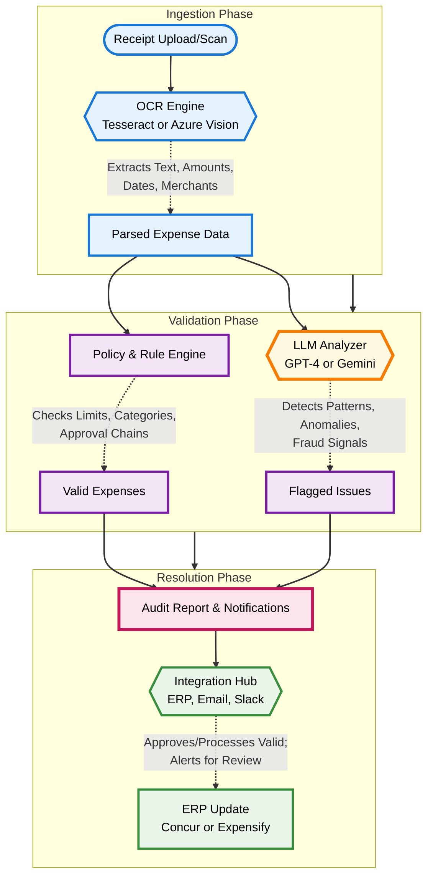

# 🧾 2. Expense Validation & Fraud Check Agent
## 🌟 Vision
To build an intelligent AI agent that revolutionizes expense management by automating the validation and fraud detection process, ensuring compliance, reducing manual reviews, and safeguarding company finances. This agent transforms reactive audits into proactive safeguards, empowering finance teams to focus on strategic initiatives while minimizing errors and fraud risks across global operations.
## 🎯 Problem Statement
Expense reporting remains a persistent pain point in modern organizations, plagued by inefficiencies and vulnerabilities. Employees submit receipts manually, leading to:
- **High Error Rates:** Illegible scans, missing details, or policy violations go unnoticed.
- **Fraud Exposure:** Duplicate claims, inflated amounts, or unauthorized expenses slip through, costing companies billions annually.
- **Manual Bottlenecks:** Finance teams spend endless hours on verification, approvals, and audits, delaying reimbursements and straining resources.
- **Compliance Gaps:** Inconsistent enforcement of travel policies, tax regulations, and approval workflows results in regulatory fines and reputational damage.
Without automation, these issues erode trust, inflate operational costs, and hinder scalability in remote and hybrid work environments.
## ✨ Solution: The Expense Guardian Agent
This project delivers a robust AI agent that acts as a vigilant gatekeeper for expense submissions. It ingests receipts, extracts insights, and enforces rules with precision.
- **Looks like:** A simple reviewer that checks reimbursement receipts.
- **Actually does:** It deploys OCR for instant data extraction, leverages LLMs and rule engines to validate against company policies and approval chains, and auto-flags suspicious activities for human review—while integrating seamlessly with ERP systems like Concur or Expensify.
**Why companies love it:** It automates 80-90% of audit compliance tasks, slashes fraud incidents by up to 50%, and frees finance teams from tedious drudgery, saving thousands of hours and millions in potential losses annually.
---
## 🏗️ Architecture & Workflow
The agent follows a streamlined, event-driven pipeline: from receipt ingestion to anomaly resolution. The diagram below visualizes this end-to-end process.

---
## 🚀 Features
### Core Features
- **Seamless Receipt Ingestion:** Supports uploads via email, mobile apps, or integrations, with instant OCR processing using Tesseract or Azure Vision for accurate text, amount, date, and merchant extraction.
- **Policy-Driven Validation:** Cross-references extracted data against customizable travel policies, spending limits, category rules, and multi-level approval chains.
- **AI-Powered Fraud Detection:** Employs LLMs to identify anomalies like unusual spending patterns, duplicates, or geo-inconsistencies, flagging high-risk items with explainable reasoning.
- **Automated Workflows:** Routes valid expenses for instant approval and reimbursement; escalates flags to finance teams via Slack, email, or dashboards for quick resolution.
- **Compliance Reporting:** Generates audit-ready logs and summaries, ensuring adherence to regulations like SOX or GDPR.
### Advanced Features (Future Roadmap)
- **Predictive Analytics:** Forecasts spending trends and flags potential policy drifts before they occur.
- **Multi-Currency & Global Support:** Handles international receipts with real-time exchange rates and locale-specific rules.
- **Integration Expansions:** Connects to HR systems for employee verification and blockchain for tamper-proof receipt validation.
- **Self-Learning Engine:** Improves detection accuracy over time by learning from resolved flags and user feedback.
## 🛠️ Tech Stack
This project harnesses a scalable, AI-centric stack for reliable fraud detection and automation.
- **Backend Framework:** [**FastAPI**](https://fastapi.tiangolo.com/) - For high-performance APIs handling uploads, processing, and integrations.
- **AI & Intelligence:** [**OpenAI GPT-4**](https://openai.com/gpt-4/) / [**Google Gemini**](https://deepmind.google/technologies/gemini/) - LLMs for anomaly detection and natural language policy interpretation.
- **OCR & Data Extraction:** [**Tesseract OCR**](https://github.com/tesseract-ocr/tesseract) / [**Azure Computer Vision**](https://azure.microsoft.com/en-us/products/ai-services/ai-vision) - For robust receipt scanning and structured data parsing.
- **Rule Engine:** [**Drools**](https://www.drools.org/) or custom Python logic - To enforce deterministic policy checks.
- **APIs & Integrations:**
  - **Expense Management:** Concur API, Expensify API
  - **Communication:** Slack API, SendGrid (email)
  - **Storage:** PostgreSQL for metadata; S3 for receipt images
- **Deployment:** Docker containers on AWS ECS or Kubernetes for scalability.
## 🏃‍♀️ Getting Started (Hypothetical)
### Prerequisites
- Python 3.9+
- API keys for OCR (Azure), LLMs (OpenAI/Google), and integrations (Concur/Slack).
- Docker for containerization.
### Installation
1. **Clone the repository:**
    ```bash
    git clone https://github.com/your-username/expense-guardian-agent.git
    cd expense-guardian-agent
    ```
2. **Set up a virtual environment and install dependencies:**
    ```bash
    python -m venv venv
    source venv/bin/activate  # On Windows: venv\Scripts\activate
    pip install -r requirements.txt
    ```
3. **Configure your environment variables:**
    - Copy `.env.example` to `.env` and populate with keys.
    ```env
    OPENAI_API_KEY="sk-..."
    AZURE_VISION_KEY="..."
    AZURE_VISION_ENDPOINT="https://your-region.api.cognitive.microsoft.com/"
    SLACK_BOT_TOKEN="xoxb-..."
    CONCUR_CLIENT_ID="..."
    CONCUR_CLIENT_SECRET="..."
    ```
4. **Run the application:**
    ```bash
    uvicorn main:app --reload --host 0.0.0.0 --port 8000
    ```
   Test with: `curl -X POST http://localhost:8000/validate -F "file=@receipt.jpg"`
## 🤝 Contributing
Contributions are encouraged! Add new OCR providers, refine fraud detection prompts, or enhance integrations. Review `CONTRIBUTING.md` for details on pull requests and code style.
## 📄 License
MIT License. See `LICENSE` for full terms.
