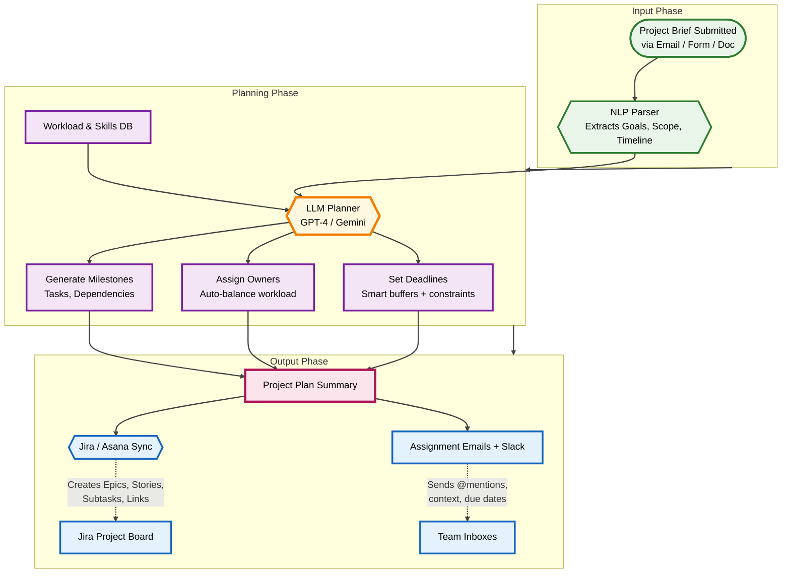

# Project Planner & Assignment Agent
## Vision
To empower teams with an AI-first project planning engine that instantly transforms high-level briefs into executable, owned, and tracked workstreams — eliminating the chaos of scattered ideas, manual task creation, and misaligned deadlines. This agent becomes the **silent co-pilot for every project manager**, ensuring nothing falls through the cracks.

## Problem Statement
Project kickoffs are messy, time-consuming, and prone to failure:
- **Ambiguous briefs** → unclear scope, duplicated work, missed deliverables.
- **Manual decomposition** → PMs spend **4–8 hours per project** breaking down tasks.
- **Assignment delays** → team members discover work late; ownership is unclear.
- **Tool silos** → updates live in email, docs, or chat — never in Jira/Asana.
- **No accountability** → deadlines are guesses; progress is invisible until it’s too late.

Result: **60% of PM time wasted on admin**, delayed launches, burned-out teams.

## Solution: The Project Planner Agent
This autonomous agent reads a **single project brief** (email, doc, or form) and **instantly generates**:
- A full task hierarchy (epics → stories → subtasks)
- Smart owner assignments (based on skills, workload, past performance)
- Realistic deadlines (with buffers and dependencies)
- Auto-created tickets in Jira/Asana
- Personalized email/Slack assignments with context

**Looks like:** “Send me a project idea — I’ll plan it.”  
**Actually does:** Full PM automation in under 2 minutes.

**Why companies love it:**  
Saves **60%+ of PM overhead**, launches projects **3x faster**, and enforces **perfect accountability** from day one.

---

## Architecture & Workflow
The agent operates in a clean, linear pipeline: **Ingest → Plan → Assign → Sync**.



---

## Features
### Core Features
- **One-Click Planning:** Submit a brief → get a full plan in <2 minutes.
- **Smart Task Breakdown:** Uses LLM + project templates to generate logical, complete workstreams.
- **Intelligent Assignment:** Matches tasks to team members by:
  - Skills & past performance
  - Current workload
  - Availability (via calendar sync)
- **Deadline Engine:** Auto-calculates realistic due dates with buffers and critical path logic.
- **Jira/Asana Sync:** Creates full project structure with epics, stories, assignees, and dependencies.
- **Personalized Notifications:** Sends tailored emails/Slack messages with context, deadlines, and one-click “Accept” buttons.

### Advanced Features (Roadmap)
- **Template Library:** Pre-trained for marketing, engineering, HR, etc.
- **Risk Flagging:** Predicts delays based on historical data.
- **Progress Tracker:** Auto-updates plan from Jira comments/check-ins.
- **Cross-Project View:** Dashboard of all active projects, bottlenecks, and resource gaps.

---

## Tech Stack
- **Orchestration:** **LangChain** + **FastAPI**
- **LLM:** **GPT-4-turbo** or **Gemini 1.5** (for reasoning + planning)
- **NLP Parsing:** Custom prompt chains + regex fallbacks
- **Data Sources:**
  - **HRIS** (BambooHR, Workday) → skills & roles
  - **Calendar API** → availability
  - **Jira/Asana REST API** → sync
- **Communication:** **Slack API**, **SendGrid**
- **Database:** **PostgreSQL** (plan history), **Redis** (caching)
- **Deployment:** **Docker + AWS ECS/Fargate**

---

## Getting Started (Hypothetical)
### Prerequisites
- Python 3.10+
- API keys: OpenAI/Google, Jira, Slack, HRIS
- Docker

### Installation
```bash
git clone https://github.com/your-org/project-planner-agent.git
cd project-planner-agent
python -m venv venv && source venv/bin/activate
pip install -r requirements.txt
```

### Configure `.env`
```env
OPENAI_API_KEY=sk-...
JIRA_BASE_URL=https://your-domain.atlassian.net
JIRA_API_TOKEN=...
SLACK_BOT_TOKEN=xoxb-...
HRIS_API_KEY=...
```

### Run
```bash
uvicorn main:app --reload --port 8000
```

### Trigger a Plan
```bash
curl -X POST http://localhost:8000/plan \
  -H "Content-Type: application/json" \
  -d '{"brief": "Launch new marketing site in 6 weeks. Team: Ana (design), Raj (dev), Sam (copy). Budget: $15k."}'
```

---

## Contributing
We welcome PRs! Improve:
- Prompt templates
- Assignment logic
- Jira field mapping
- UI dashboard

See `CONTRIBUTING.md`

## License
MIT License. See `LICENSE`.
