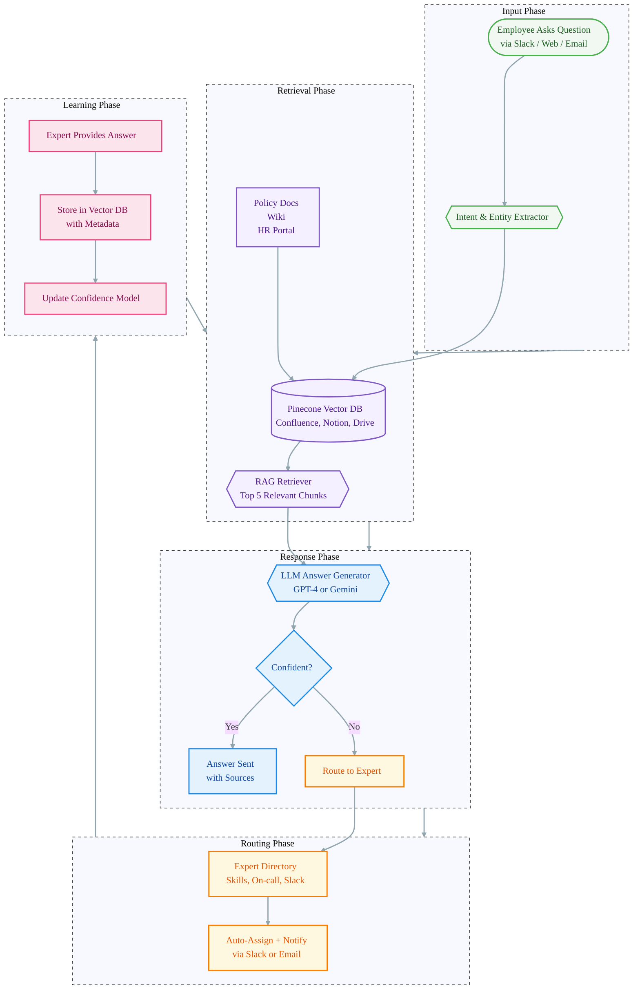

# Internal Q&A + Knowledge Routing Agent  
## Vision  
To create an **always-on, intelligent internal assistant** that instantly answers employee questions using company knowledge — and when it can’t, **routes the query to the perfect human expert** — all while **learning and improving** from every interaction. This agent eliminates the endless Slack pings, email chains, and outdated wikis that slow teams down.

---

## Problem Statement  
Employees waste **hours every week** searching for answers:  
- **Fragmented knowledge** across Confluence, Notion, Drive, Slack, HR portals.  
- **Repeated questions** (“How do I expense a meal?”, “Who approves PTO?”) → HR/helpdesk overload.  
- **Wrong answers** from outdated docs or tribal knowledge.  
- **No escalation path** — employees give up or ask the wrong person.  
- **Zero learning** — resolved answers aren’t captured for reuse.  

**Result:** 40–60% of internal support time wasted on repeat queries.

---

## Solution: The Knowledge Router Agent  
A **self-improving Q&A engine** that:  
1. **Searches** all internal sources in real time  
2. **Answers** 80%+ of questions instantly  
3. **Routes** the rest to the right expert (with context)  
4. **Learns** from every resolution  

**Looks like:** “Ask me anything about policy, tools, or process.”  
**Actually does:** Full RAG + smart routing + feedback loop.

**Why companies love it:**  
- **Cuts HR/helpdesk load by 70%**  
- **24/7 instant answers**  
- **Auto-updates knowledge base**  
- **Onboards new hires in hours, not days**

---

## Architecture & Workflow  


---

## Features  

### Core Features  
- **Natural Language Search** across **Confluence, Notion, Google Drive, HRIS**  
- **Instant Answers** with **source links** and confidence score  
- **Smart Routing** to the right expert (based on topic, availability, past answers)  
- **Auto-Learning** — every expert response becomes a new knowledge chunk  
- **Slack-First Interface** — `@knowledge ask "How do I set up 2FA?"`  
- **Feedback Loop** — thumbs up/down → retrain embeddings  

### Advanced Features (Roadmap)  
- **Proactive Answers** — suggest policies during onboarding or expense submission  
- **Multilingual Support** — for global teams  
- **Audit Trail** — who asked what, who answered, when  
- **Knowledge Health Dashboard** — gaps, stale docs, top unanswered questions  

---

## Tech Stack  
| Layer | Tech |
|------|------|
| **Orchestration** | **LangChain** + **FastAPI** |
| **LLM** | **GPT-4-turbo** or **Gemini 1.5 Flash** |
| **Vector DB** | **Pinecone** (or **Weaviate** / **Qdrant**) |
| **RAG Pipeline** | **Hybrid search** (keyword + semantic) |
| **Sources** | **Confluence API**, **Notion API**, **Google Drive API**, **Slack Events API** |
| **Routing Logic** | **Expert Directory** (PostgreSQL + skills tags) |
| **Deployment** | **Docker + AWS ECS / GCP Cloud Run** |
| **Monitoring** | **LangSmith** + **Sentry** |

---

## Getting Started (Hypothetical)  

### Prerequisites  
- Python 3.10+  
- API keys: OpenAI/Google, Pinecone, Confluence, Notion, Slack  
- Docker  

### Installation  
```bash
git clone https://github.com/your-org/knowledge-router-agent.git
cd knowledge-router-agent
python -m venv venv && source venv/bin/activate
pip install -r requirements.txt
```

### Configure `.env`  
```env
OPENAI_API_KEY=sk-...
PINECONE_API_KEY=...
PINECONE_INDEX=company-knowledge
CONFLUENCE_BASE_URL=https://your-domain.atlassian.net
CONFLUENCE_TOKEN=...
NOTION_API_KEY=secret_...
SLACK_BOT_TOKEN=xoxb-...
```

### Run  
```bash
uvicorn main:app --reload --port 8000
```

### Index Your Docs (First Run)  
```bash
python scripts/ingest.py --source confluence notion drive
```

### Ask a Question  
```bash
curl -X POST http://localhost:8000/ask \
  -H "Content-Type: application/json" \
  -d '{"question": "How do I request parental leave?"}'
```

---

## Contributing  
Help us improve:  
- Add new data sources (SharePoint, Zendesk)  
- Refine routing logic  
- Build a web UI  
- Improve answer evaluation prompts  

See `CONTRIBUTING.md`

---

## License  
MIT License. See `LICENSE`.
