# 🎯 Integrated Mining Blast Operations AI Agent: BlastMaster

## 🌟 Vision
To deploy a unified, autonomous AI agent suite that orchestrates the entire mining blast lifecycle—from optimization and scheduling to real-time hazard monitoring, post-blast inspection, and outcome analytics—leveraging multi-agent systems and advanced frameworks like LangGraph and LangChain. This "BlastMaster" transforms hazardous, manual blast operations into a safe, data-driven, predictive powerhouse, reducing risks, costs, and downtime while maximizing ore recovery and compliance.

## 🎯 Problem Statement
Mining blast operations are fragmented, high-risk, and inefficient, leading to:
- **Safety Gaps:** Manual inspections post-blast expose workers to unstable rockfalls, toxic gases, or vibrations; real-time monitoring during blasts often lags, causing accidents.
- **Optimization Challenges:** Blast designs rely on heuristics, resulting in overbreak (wasted rock), excessive vibration, and suboptimal ore fragmentation—costing millions in explosives and cleanup.
- **Data Silos:** Post-blast analytics are retrospective and siloed, missing opportunities to learn from fragmentation, recovery rates, and sensor data for future improvements.
- **Coordination Overhead:** Teams (drill, load, blast, inspect) operate in isolation, with delays in scheduling, assignments, and evacuations.
- **Scalability Issues:** Traditional methods don't scale with robotics/drones or integrate LiDAR/sensor feeds effectively.

Without integration, mining firms face 20-30% higher costs, regulatory fines, and safety incidents—exacerbated by remote sites and variable rock conditions.

## ✨ Solution: BlastMaster AI Agent Suite
BlastMaster is a single, multi-agent orchestrator that ingests site data (geometry, sensors, drones) and autonomously manages the blast pipeline:
- **Pre-Blast:** Optimizes designs and schedules.
- **During-Blast:** Monitors hazards in real-time.
- **Post-Blast:** Inspects via drones, analyzes outcomes, and feeds learnings back.

**Looks like:** A dashboard bot that "handles the blast from plan to review."  
**Actually does:** Deploys LangGraph for agent coordination, LangChain for LLM-driven decisions, and LlamaIndex for efficient data retrieval—auto-generating plans, halting ops if unsafe, dispatching drones, and iterating designs via ML.

**Why companies love it:**  
Integrates existing robotics (e.g., Oinride drones) to cut safety incidents by 70%, optimize blasts for 15-25% cost savings, and enable predictive analytics—backed by arXiv research on multi-agent subterranean systems and Infosys/Global Industry Herald insights on AI in extraction.

---
## 🏗️ Architecture & Workflow
BlastMaster uses a cyclical, event-driven pipeline orchestrated by LangGraph: Pre → During → Post → Learn. Multi-agents collaborate via shared state.

```mermaid
%%{init: {'theme': 'base', 'themeVariables': {
  'background':'#ffffff',
  'primaryColor':'#0d47a1',
  'secondaryColor':'#2e7d32',
  'tertiaryColor':'#ff9800',
  'edgeLabelBackground':'#f8f9fa',
  'fontFamily':'system-ui, -apple-system, "Segoe UI", Roboto, "Helvetica Neue", Arial',
  'nodeBorderRadius':'8px'
}}}%%
flowchart TD
  %% === Pre-Blast (top) ===
  subgraph PRE["🛠️ Pre-Blast Optimization"]
    direction TB
    A[📐<br/><b>Site Data Input</b><br/><sub>Geometry · Rock type · Past blasts</sub>]:::boxA
    C[(📚 LlamaIndex<br/><sub>Historical data & embeddings</sub>)]:::db
    B{{⚙️ Optimization Agent<br/><sub>Suggests patterns · charges · timing</sub>}}:::agent
    D[🗓️ Schedule & Assign<br/><sub>Drill · Load · Blast teams</sub>]:::boxA
    A --> B
    C --> B
    B --> D
  end

  %% === During-Blast ===
  subgraph DUR["⚠️ During-Blast Monitoring"]
    direction TB
    E[📡 Real-time Sensors<br/><sub>Gas · Vibration · CCTV / Drone</sub>]:::sensor
    F{{🚨 Hazard Agent<br/><sub>Threshold checks · auto-halt · alerts</sub>}}:::agent
    G{Unsafe?}:::decision
    H[🔕 Notify Teams & Pause Ops]:::alert
    I[✅ Continue → Post-Blast]:::ok
    E --> F
    D --> F
    F --> G
    G -->|Yes| H
    G -->|No| I
  end

  %% === Post-Blast ===
  subgraph POST["🔍 Post-Blast Inspection"]
    direction TB
    J[🚁 Drone / LiDAR Scan<br/><sub>Rock stability · fragmentation</sub>]:::sensor
    K{{🧭 Inspection Agent<br/><sub>Risk analysis · report generation</sub>}}:::agent
    L[🟢 Safety Clearance<br/>or 🔴 Remediation Alert]:::boxB
    I --> J
    J --> K
    K --> L
  end

  %% === Analytics & Learning (bottom) ===
  subgraph AN["📊 Analytics & Learning"]
    direction TB
    M[📥 Collect Outcomes<br/><sub>Vibration · Recovery · Cost</sub>]:::db
    N{{🔎 Analytics Agent<br/><sub>Learn patterns · recommend improvements</sub>}}:::agent
    O[↻ Update LlamaIndex & LangGraph State]:::db
    L --> N
    M --> N
    N --> O
  end

  %% Feedback loop (curved, non-blocking)
  O -. Feedback .-> A

  %% Styling
  classDef boxA fill:#e3f2fd,stroke:#0d47a1,stroke-width:1.5px,color:#0d47a1, border-radius:8px;
  classDef boxB fill:#e8f5e9,stroke:#2e7d32,stroke-width:1.5px,color:#2e7d32, border-radius:8px;
  classDef db fill:#fff3e0,stroke:#ff9800,stroke-width:1.5px,color:#bf360c, border-radius:8px;
  classDef sensor fill:#f3e5f5,stroke:#6a1b9a,stroke-width:1.5px,color:#4a148c, border-radius:8px;
  classDef agent fill:#fff8e1,stroke:#ffb300,stroke-width:1.5px,color:#e65100, border-radius:10px;
  classDef decision fill:#fff9c4,stroke:#f9a825,stroke-width:1.5px,color:#f57f17, border-radius:10px;
  classDef alert fill:#ffebee,stroke:#c62828,stroke-width:1.5px,color:#b71c1c, border-radius:8px;
  classDef ok fill:#e8f5e9,stroke:#2e7d32,stroke-width:1.5px,color:#2e7d32, border-radius:8px;

  %% Link styling for clarity
  linkStyle default stroke:#90a4ae, stroke-width:1.25px;

  %% Accessibility tweaks (force label wrapping so narrow canvases don't compress too small)
  style A text-align:center;
  style B text-align:center;
  style C text-align:center;
  style D text-align:center;
  style E text-align:center;
  style F text-align:center;
  style G text-align:center;
  style H text-align:center;
  style I text-align:center;
  style J text-align:center;
  style K text-align:center;
  style L text-align:center;
  style M text-align:center;
  style N text-align:center;
  style O text-align:center;
```



---
## 🚀 Features
### Core Features
- **Blast Optimization:** Analyzes geometry/rock data via LLM chains to minimize overbreak/vibration; auto-schedules with task assignments to Jira/Slack.
- **Real-Time Hazard Monitoring:** Integrates sensors/drone feeds; auto-halts blasts and triggers evacuations if thresholds breached.
- **Post-Blast Inspection:** Dispatches autonomous drones (e.g., Oinride-compatible) for LiDAR scans; assesses stability, generates reports, clears sites.
- **Outcome Analytics:** Post-blast, crunches fragmentation/recovery data; uses ML to learn and refine future designs.
- **Multi-Agent Coordination:** LangGraph agents collaborate (e.g., Hazard Agent pauses Optimization Agent).
- **Alerts & Reporting:** Instant notifications via SMS/Slack; compliance-ready PDFs with visuals.

### Advanced Features (Roadmap)
- **Predictive Simulations:** Run "what-if" blasts using physics sims (e.g., via PySCF for explosive modeling).
- **Multi-Site Scaling:** Federate across mines with shared LlamaIndex knowledge base.
- **AR/VR Integration:** Overlay drone maps in AR for remote inspections.
- **Sustainability Analytics:** Track emissions/carbon from blasts for ESG reporting.

## 🛠️ Tech Stack
This suite leverages advanced frameworks for robust, scalable AI orchestration.
- **Orchestration:** [**LangGraph**](https://langchain-ai.github.io/langgraph/) - Multi-agent workflows with stateful graphs for blast phases.
- **LLM Chains & Tools:** [**LangChain**](https://www.langchain.com/) - Prompt chains for optimization/decision-making; integrates with OpenAI GPT-4o or Gemini 1.5.
- **Data Indexing & Retrieval:** [**LlamaIndex**](https://www.llamaindex.ai/) - Indexes sensor/historical data for fast RAG queries.
- **Other Advanced Frameworks:**
  - **CrewAI** - For agent collaboration in inspections.
  - **Haystack** - Hybrid search for real-time sensor fusion.
  - **Autogen** - Human-in-loop for expert overrides.
- **Integrations:**
  - **Sensors/Drones:** MQTT for real-time feeds; Oinride/Infosys robotics APIs.
  - **ML/Analytics:** PyTorch for fragmentation prediction; RDKit for rock chem modeling.
  - **Task Mgmt:** Jira/Asana APIs for assignments.
  - **Communication:** Twilio (SMS), Slack API.
- **Backend:** Python (FastAPI); Database: PostgreSQL + Pinecone (vectors).
- **Deployment:** Docker/Kubernetes on AWS/GCP; Edge computing for remote sites.

## 🏃‍♀️ Getting Started (Hypothetical)
### Prerequisites
- Python 3.11+
- API keys: OpenAI/Gemini, Pinecone, drone vendors (e.g., Oinride).
- Docker for edge deployment.

### Installation
1. **Clone the repository:**
   ```bash
   git clone https://github.com/your-org/blastmaster-agent.git
   cd blastmaster-agent
   ```
2. **Set up environment:**
   ```bash
   python -m venv venv
   source venv/bin/activate  # Windows: venv\Scripts\activate
   pip install -r requirements.txt  # Includes LangChain, LangGraph, LlamaIndex
   ```
3. **Configure `.env`:**
   ```env
   OPENAI_API_KEY="sk-..."
   PINECONE_API_KEY="..."
   OINRIDE_DRONE_API="..."
   JIRA_BASE_URL="https://your-domain.atlassian.net"
   JIRA_TOKEN="..."
   SLACK_BOT_TOKEN="xoxb-..."
   ```
4. **Index Initial Data:**
   ```bash
   python scripts/index_data.py --sources sensors historical_blasts
   ```
5. **Run the Orchestrator:**
   ```bash
   uvicorn main:app --reload --port 8000
   ```

### Test a Blast Cycle
```bash
curl -X POST http://localhost:8000/optimize \
  -H "Content-Type: application/json" \
  -d '{
    "geometry": {"volume": 5000, "rock_type": "granite"},
    "constraints": {"max_vibration": 10}
  }'
```

## 🤝 Contributing
Contributions welcome! Enhance:
- Agent prompts for rock-type specifics.
- Drone integrations (e.g., arXiv multi-agent protocols).
- Analytics models for sustainability.

See `CONTRIBUTING.md` for guidelines.

## 📄 License
MIT License. See `LICENSE` for details.
