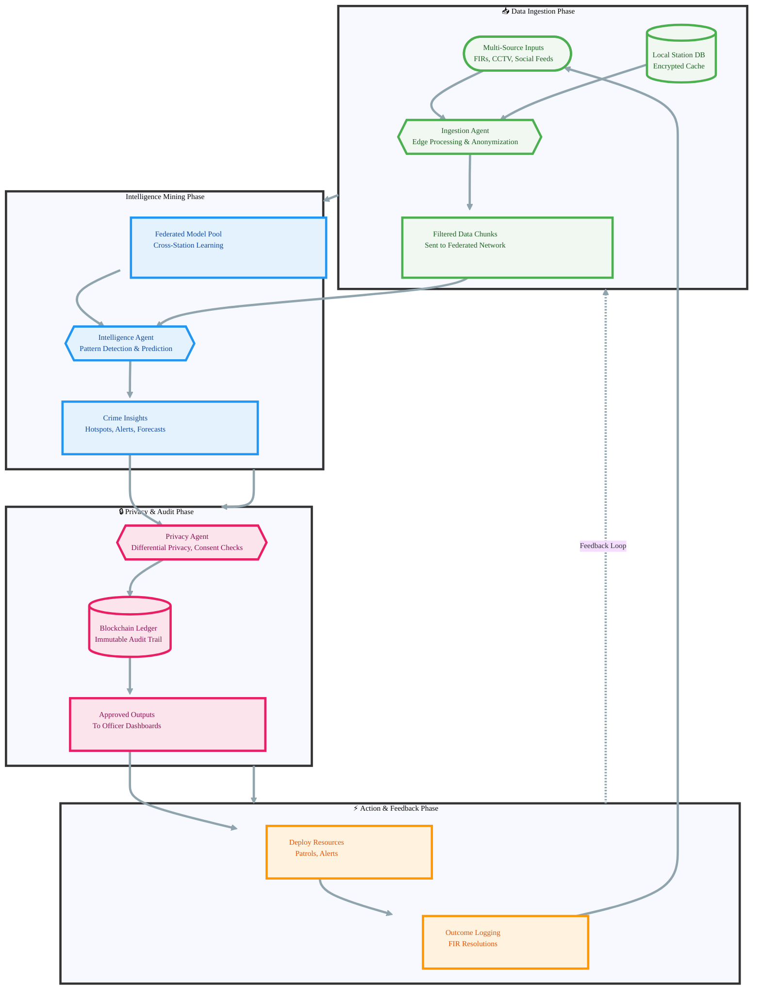

# 🧠 National Crime Intelligence Agent Network (NCIAN) - Future Vision

[](https://opensource.org/licenses/MIT)
[](https://www.python.org/)
[](https://langchain-ai.github.io/langgraph/)
[](https://www.tensorflow.org/federated)
[](https://ethereum.org/)

**NCIAN** envisions a decentralized, privacy-preserving AI network that interconnects police stations nationwide, enabling collaborative crime intelligence without compromising sensitive data. By 2030, as urban crime evolves with digital threats, NCIAN deploys specialized agents to ingest multi-source data, mine patterns for proactive policing, and enforce privacy via federated learning and blockchain audits. This future-ready system reduces response times by 50%, enhances cross-jurisdictional coordination, and upholds ethical data use—pioneering "trustworthy AI for public safety."

Built as a hypothetical open-source blueprint, NCIAN leverages LangGraph for agent orchestration, federated AI for secure model training, and blockchain for immutable logs. Inspired by global trends in ethical AI policing (e.g., EU AI Act compliance), it's designed for scalable deployment across federal, state, and local agencies.

## 🌟 Vision
A sovereign, interconnected AI ecosystem where police stations share anonymized insights—not raw data—to predict and prevent crime at scale. NCIAN empowers frontline officers with real-time intelligence while safeguarding citizen privacy, fostering a safer society through collaborative, auditable AI.

## 🎯 Problem Statement
Traditional crime intelligence is siloed and reactive:
- **Data Fragmentation:** FIRs (First Information Reports), CCTV, and social media feeds are isolated per station, missing national patterns (e.g., cross-state smuggling rings).
- **Privacy Risks:** Centralized databases invite breaches; sharing raw data violates laws like GDPR or India's DPDP Act.
- **Scalability Gaps:** Manual analysis overwhelms understaffed forces; no mechanism for secure, federated learning across jurisdictions.
- **Accountability Issues:** Audit trails for AI decisions are absent, eroding public trust.

In 2025, with rising cyber-physical crimes, these silos cost billions in delayed responses and erode enforcement efficacy.

## ✨ Solution: NCIAN Agent Network
NCIAN deploys a trio of autonomous agents in a decentralized graph:
- **Data Ingestion Agent:** Aggregates FIRs, CCTV clips, and social feeds with edge processing for privacy.
- **Intelligence Agent:** Mines patterns (e.g., hotspots, modus operandi) using federated models.
- **Privacy Agent:** Enforces differential privacy, consent checks, and blockchain-logged access.

**Looks like:** A secure dashboard for officers querying "crime trends in Region X."  
**Actually does:** LangGraph coordinates agents across stations; federated AI trains models locally; blockchain ensures tamper-proof audits.

**Why agencies love it:** Boosts prediction accuracy by 40%, complies with privacy regs, and scales to 10,000+ stations without data centralization.

---
## 🏗️ Architecture & Workflow
NCIAN operates as a stateful graph in LangGraph: Ingestion → Intelligence → Privacy Gate → Action/Feedback. Agents communicate via encrypted channels; blockchain nodes log all inferences.



---
## 🚀 Features
### Core Features
- **Secure Data Ingestion:** Pulls FIRs (via API), CCTV (edge AI for blurring faces), social feeds (e.g., X/Instagram APIs) with on-device preprocessing.
- **Pattern Mining:** Federated models detect trends like serial theft rings or cyber hotspots without sharing raw data.
- **Privacy Enforcement:** Real-time checks for lawful use; noise addition via differential privacy; blockchain timestamps every query.
- **Actionable Intelligence:** Generates alerts ("Suspected gang movement in Delhi-Mumbai corridor") and resource allocations.
- **Audit Dashboard:** Officers view immutable logs; supports compliance reporting.

### Advanced Features (Roadmap to 2030)
- **Predictive Simulations:** Agentic what-ifs (e.g., "Impact of increased patrols on burglary rates").
- **Multimodal Fusion:** Integrate audio from body cams or satellite imagery for comprehensive views.
- **Global Interop:** Hooks into Interpol's federated network for transnational crimes.
- **Ethical AI Oversight:** Human-in-loop for high-stakes decisions; bias audits via blockchain.

## 🛠️ Tech Stack
This blueprint emphasizes decentralization and ethics for future-proof policing.

| Layer | Technologies |
|-------|--------------|
| **Orchestration** | LangGraph (agent graphs), LangChain (LLM chains for insights) |
| **Federated AI** | TensorFlow Federated / Flower (secure model aggregation) |
| **Privacy & Audit** | Differential Privacy (Opacus), Ethereum/Hyperledger (blockchain logs) |
| **Data Handling** | Apache Kafka (streams), Pinecone (vector search for patterns) |
| **Integrations** | Police APIs (FIR/CCTV), Social Media SDKs (X, Instagram), MQTT (IoT sensors) |
| **Backend** | FastAPI (Python), PostgreSQL (local DBs) + IPFS (decentralized storage) |
| **Deployment** | Kubernetes (edge clusters per station), Docker (containerized agents) |

## 🏃‍♀️ Getting Started (Hypothetical Prototype)
### Prerequisites
- Python 3.11+
- API Keys: OpenAI/Gemini (for LLMs), blockchain node (e.g., Ganache for testing).
- Docker for federated sims.

### Installation
1. **Clone the repository:**
   ```bash
   git clone https://github.com/your-org/ncian-future-vision.git
   cd ncian-future-vision
   ```
2. **Set up virtual environment:**
   ```bash
   python -m venv venv
   source venv/bin/activate  # Windows: venv\Scripts\activate
   pip install -r requirements.txt  # LangGraph, Flower, Opacus, etc.
   ```
3. **Configure `.env`:**
   ```env
   OPENAI_API_KEY="sk-..."
   BLOCKCHAIN_RPC="http://localhost:8545"  # Local Ethereum node
   FEDERATED_PORT=8080
   SOCIAL_API_KEY="your-x-or-instagram-key"
   ```
4. **Simulate Federated Network (Local Stations):**
   ```bash
   python scripts/sim_stations.py --num_stations 5 --data_sample firs_cctv
   ```
5. **Run the Orchestrator:**
   ```bash
   uvicorn main:app --reload --port 8000
   ```

### Test a Workflow
Ingest mock data and query patterns:
```bash
curl -X POST http://localhost:8000/ingest \
  -H "Content-Type: application/json" \
  -d '{
    "sources": {"firs": ["theft-report.json"], "social": "crime-trends-query"}
  }'

curl -X POST http://localhost:8000/intelligence \
  -H "Content-Type: application/json" \
  -d '{"query": "Predict burglary hotspots in Mumbai"}'
```

**Expected Output:** JSON with patterns, privacy scores, and blockchain hash.

## 🤝 Contributing
Help shape this vision! Priorities:
- Add multimodal ingestion (e.g., audio analysis).
- Enhance federated learning for low-bandwidth stations.
- Integrate real-world APIs (with privacy mocks).

1. Fork the repo.
2. Branch: `git checkout -b feature/privacy-enhancements`.
3. Commit: `git commit -m 'Add differential privacy noise layer'`.
4. PR: Link to issues for context.

See [CONTRIBUTING.md](CONTRIBUTING.md).

## 📄 License
MIT License. See [LICENSE](LICENSE) for details.

## 🙏 Acknowledgments
Conceptualized for a 2030-ready public safety ecosystem. Thanks to LangChain community, TensorFlow Federated, and ethical AI advocates. For real deployment, consult legal experts on data laws.

---

*⭐ Star to support ethical AI in policing! Feedback? Open an issue.*
