# AI-Social-Media-Projects-2025

[](https://opensource.org/licenses/MIT)
[](https://www.python.org/)
[](https://www.langchain.com/)
[](https://huggingface.co/)
[](https://github.com/your-org/ai-social-media-projects-2025)

**AI-Social-Media-Projects-2025** is a curated collection of open-source inspired AI project ideas for social media platforms, tailored for 2025 trends in automation, personalization, and predictive analytics. These prototypes leverage frameworks like LangChain, Hugging Face, and TensorFlow to address real-world challenges like content creation, moderation, and user retention. Whether you're a developer, creator, or platform builder, these ideas are designed for quick iteration—many start with free tiers of APIs like Grok or OpenAI.

Inspired by emerging 2025 trends emphasizing AI-human symbiosis, this repo provides starter code snippets, architecture diagrams, and roadmaps. Fork, build, and contribute to shape the future of social media!

## 🌟 Overview
Social media in 2025 is AI-native: from viral prediction to ethical moderation, these projects tackle scalability, privacy, and immersion. We've grouped them into **Practical Builds** (ready-to-prototype) and **Future Horizons** (visionary solutions). Each includes:
- **Why Build It:** Impact metrics.
- **Tech Stack:** Core tools.
- **Starter Snippet:** Quick code hook.

## 🏗️ Project Ecosystem Diagram
This Mermaid graph visualizes how the projects interconnect—nodes represent ideas, edges show thematic links (e.g., NLP → Moderation), and colors denote focus areas (blue: Automation, green: Personalization, purple: Ethics/Safety).

```mermaid
%%{init: {'theme': 'base', 'themeVariables': {'background': '#ffffff', 'fontSize': '10px'}}}%%
graph TD
    subgraph Automation ["🔄 Automation Focus"]
        P1[Content Curator & Scheduler\nLangChain + Stable Diffusion]
        P2[Sentiment & Crisis Monitor\nHugging Face + Streamlit]
        P6[Viral Predictor & Trend Forecaster\nProphet + APIs]
    end
    subgraph Personalization ["👤 Personalization Focus"]
        P3[Personalized Feed Optimizer\nTensorFlow Recommenders]
        P7[AR-Enhanced Storytelling\nARKit + Unity]
    end
    subgraph Ethics ["⚖️ Ethics & Safety Focus"]
        P4[AI Moderation & Toxicity Detector\nCLIP + FastAPI]
        P5[Influencer Matcher\nNeo4j + OpenAI]
    end
    subgraph Future ["🚀 Future Horizons"]
        F1[Decentralized Moderation\nBlockchain + Agents]
        F2[Privacy-First Avatars\nOn-Device LLMs]
        F3[Emotion-Aware Feeds\nMultimodal AI]
        F4[Sustainable Optimization\nCarbon-Aware Agents]
        F5[Semantic Search Hubs\nFederated Learning]
    end

    P1 --> P2
    P2 --> P6
    P3 --> P7
    P4 --> P5
    P6 -.-> F5
    P7 -.-> F3
    P5 -.-> F1
    P4 -.-> F2
    F1 -.-> P4
    F2 -.-> P3
    F3 -.-> P7
    F4 -.-> P6
    F5 -.-> P1

    classDef auto fill:#e3f2fd,stroke:#2196f3,stroke-width:2px
    classDef pers fill:#e8f5e8,stroke:#4caf50,stroke-width:2px
    classDef eth fill:#fce4ec,stroke:#e91e63,stroke-width:2px
    classDef fut fill:#fff3e0,stroke:#ff9800,stroke-width:2px

    class P1,P2,P6 auto
    class P3,P7 pers
    class P4,P5 eth
    class F1,F2,F3,F4,F5 fut

    linkStyle default stroke:#90a4ae,stroke-width:2px
```



## 🚀 Good AI Projects for Social Media (2025 Edition)
Practical, buildable ideas focused on open-source prototypes. Each can be hacked together in a weekend.

### 1. AI-Powered Content Curator & Scheduler
An agent that scans trends across platforms (e.g., TikTok, X), generates tailored posts/captions/videos, and schedules them for optimal engagement. Uses NLP for sentiment-aligned content.  
**Why build it:** Automates 70% of creator workflows.  
**Tech:** LangChain + Stable Diffusion for visuals.

**Starter Snippet (Python):**
```python
from langchain_openai import ChatOpenAI
from langchain.prompts import PromptTemplate
import schedule
import time

llm = ChatOpenAI(model="gpt-4o-mini")
prompt = PromptTemplate.from_template("Generate a viral TikTok caption for {trend} with positive sentiment.")
def curate_content(trend):
    caption = llm.invoke(prompt.format(trend=trend)).content
    # Post to API (e.g., TikTok SDK)
    print(f"Scheduled: {caption}")

schedule.every(6).hours.do(curate_content, "AI trends 2025")
while True:
    schedule.run_pending()
    time.sleep(1)
```

### 2. Real-Time Sentiment & Crisis Monitor
Monitors brand mentions in real-time, analyzes emotions from posts/comments, and alerts teams to brewing issues (e.g., viral complaints). Integrates with Slack for instant responses.  
**Why build it:** Reduces response time from hours to minutes, preventing PR disasters.  
**Tech:** Hugging Face Transformers + Streamlit dashboard.

**Starter Snippet (Python):**
```python
from transformers import pipeline
import streamlit as st
from slack_sdk import WebClient

sentiment_pipeline = pipeline("sentiment-analysis")
slack_client = WebClient(token="your-slack-token")

def monitor_mentions(mentions):
    for mention in mentions:
        result = sentiment_pipeline(mention['text'])[0]
        if result['label'] == 'NEGATIVE' and result['score'] > 0.7:
            slack_client.chat_postMessage(channel="#alerts", text=f"Crisis alert: {mention['text']}")

st.title("Sentiment Monitor")
mentions = st.text_area("Paste mentions").split('\n')
if st.button("Analyze"):
    monitor_mentions([{'text': m} for m in mentions])
```

### 3. Personalized Feed Optimizer
A cross-platform recommendation engine that learns user preferences (beyond likes) to suggest content, reducing echo chambers via diverse sourcing.  
**Why build it:** Boosts retention by 20-30% on niche apps.  
**Tech:** TensorFlow Recommenders + API integrations (Instagram, X).

**Starter Snippet (Python):**
```python
import tensorflow_recommenders as tfrs
import tensorflow as tf

# Sample user-item interactions
user_model = tf.keras.Sequential([tf.keras.layers.Embedding(1000, 32)])
item_model = tf.keras.Sequential([tf.keras.layers.Embedding(5000, 32)])
metrics = tfrs.metrics.FactorizedTopK(candidates=item_model(0))
task = tfrs.tasks.Retrieval(
    metrics=metrics, embeddings=user_model(0), embeddings=item_model(0)
)
model = tfrs.Model(user_model=user_model, item_model=item_model, task=task)
# Train on your dataset: model.compile(optimizer=tf.keras.optimizers.Adagrad(0.5))
# model.fit(interactions, epochs=3)
```

### 4. AI Moderation & Toxicity Detector
Scans uploads for hate speech, deepfakes, or misinformation using multimodal AI (text + image/video), with explainable flags for human review.  
**Why build it:** Platforms face rising regulatory pressure; scales to billions of posts.  
**Tech:** CLIP model + FastAPI backend.

**Starter Snippet (Python):**
```python
from transformers import CLIPProcessor, CLIPModel
import torch
from fastapi import FastAPI

model = CLIPModel.from_pretrained("openai/clip-vit-base-patch32")
processor = CLIPProcessor.from_pretrained("openai/clip-vit-base-patch32")
app = FastAPI()

@app.post("/moderate")
def moderate_text_image(text: str, image_path: str):
    inputs = processor(text=[text], images=image_path, return_tensors="pt", padding=True)
    outputs = model(**inputs)
    logits_per_image = outputs.logits_per_image
    probs = logits_per_image.softmax(dim=1)
    toxicity_score = probs[0][1].item()  # Assume index 1 is toxic class
    return {"toxicity": toxicity_score > 0.8}

if __name__ == "__main__":
    import uvicorn
    uvicorn.run(app, host="0.0.0.0", port=8000)
```

### 5. Influencer Collaboration Matcher
Matches brands with micro-influencers by analyzing audience overlap, engagement rates, and value alignment via graph neural networks.  
**Why build it:** Streamlines marketing ROI in a fragmented creator economy.  
**Tech:** Neo4j for graphs + OpenAI embeddings.

**Starter Snippet (Python):**
```python
from neo4j import GraphDatabase
from openai import OpenAI

driver = GraphDatabase.driver("bolt://localhost:7687", auth=("neo4j", "password"))
client = OpenAI(api_key="your-key")

def match_influencers(brand_embedding):
    with driver.session() as session:
        query = """
        MATCH (b:Brand)-[:SIMILAR_TO]-(i:Influencer)
        WHERE b.embedding ~ brand_embedding
        RETURN i.name, i.engagement ORDER BY i.engagement DESC LIMIT 5
        """
        result = session.run(query, brand_embedding=brand_embedding)
        return [record["i.name"] for record in result]

# Embed brand description
embedding = client.embeddings.create(input="Eco-fashion brand", model="text-embedding-3-small").data[0].embedding
matches = match_influencers(embedding)
print(matches)
```

### 6. Viral Predictor & Trend Forecaster
Predicts post virality based on historical data, timing, and multimodal features (e.g., music in Reels), suggesting tweaks pre-publish.  
**Why build it:** Helps creators hit algorithms first try.  
**Tech:** Prophet for forecasting + YouTube/TikTok APIs.

**Starter Snippet (Python):**
```python
from prophet import Prophet
import pandas as pd

# Sample data: df = pd.DataFrame({'ds': dates, 'y': views})
model = Prophet(daily_seasonality=True)
model.fit(df)
future = model.make_future_dataframe(periods=30)
forecast = model.predict(future)
print(forecast[['ds', 'yhat', 'yhat_lower', 'yhat_upper']].tail())

# Suggest tweaks: if forecast['yhat'].mean() < threshold, "Add trending audio"
```

### 7. AR-Enhanced Social Storytelling Tool
Lets users create interactive AR filters/stories that AI customizes based on location or mood, shared across platforms.  
**Why build it:** Powers the next wave of immersive social experiences.  
**Tech:** ARKit/ARCore + Unity integration.

**Starter Snippet (Unity C# - Pseudo):**
```csharp
using UnityEngine;
using UnityEngine.XR.ARFoundation;

public class ARStoryteller : MonoBehaviour
{
    public ARSessionOrigin arOrigin;
    void Start()
    {
        // AI customizes filter based on GPS/mood input
        string mood = GetMoodFromAPI("user_mood");  // Call to Grok API
        if (mood == "happy") { Instantiate(happyFilterPrefab); }
    }
}
```

## 🔮 Best Future Potential Solutions for Social Media (2025+ Horizon)
Visionary ideas poised for explosive growth, addressing ethics, metaverses, and sustainability.

### 1. Decentralized AI Moderation Networks
Blockchain-based agents that crowdsource moderation decisions transparently, reducing bias and enabling user-owned platforms.  
**Potential:** Resolves trust issues in Big Tech; could power Web3 social apps like Farcaster 2.0.

### 2. Privacy-First Personal AI Avatars
On-device LLMs that represent users in feeds/chats, negotiating interactions (e.g., "share mood but not location").  
**Potential:** Complies with GDPR 2.0 while boosting engagement; integrates with edge AI for low-latency metaverses.

### 3. Multimodal Emotion-Aware Feeds
AI that detects user emotions via camera/audio (opt-in) to curate uplifting content, combating mental health crises.  
**Potential:** 40% drop in platform churn; partnerships with wellness apps like Calm.

### 4. Sustainable Content Optimization
Agents that minimize carbon footprints of viral videos (e.g., compress without quality loss) and reward eco-friendly creators.  
**Potential:** Aligns with ESG mandates; could offset 10-15% of data center emissions from social traffic.

### 5. Cross-Platform Semantic Search Hubs
Unified AI search across all socials (via federated learning) for "find viral memes about AI ethics."  
**Potential:** Becomes the "Google of social," with AR overlays for real-world discovery.

These ideas draw from 2025 trends in AI-human symbiosis. Prototype on GitHub—leverage Grok API free tiers for rapid iteration!

## 🛠️ Shared Tech Stack
| Category | Tools |
|----------|-------|
| **Orchestration** | LangChain, Streamlit |
| **Models/ML** | Hugging Face Transformers, TensorFlow, Stable Diffusion |
| **APIs/Integrations** | X/Instagram/TikTok APIs, Slack, OpenAI/Grok |
| **Deployment** | FastAPI, Docker, Vercel |
| **Databases/Graphs** | Neo4j, Pinecone (vectors) |

## 🏃‍♀️ Getting Started
1. **Clone the Repo:**
   ```bash
   git clone https://github.com/your-org/ai-social-media-projects-2025.git
   cd ai-social-media-projects-2025
   ```
2. **Install Dependencies:**
   ```bash
   pip install -r requirements.txt  # LangChain, transformers, etc.
   ```
3. **Set API Keys in `.env`:**
   ```env
   OPENAI_API_KEY="sk-..."
   HUGGINGFACE_TOKEN="hf_..."
   SLACK_TOKEN="xoxb-..."
   ```
4. **Run a Demo (e.g., Sentiment Monitor):**
   ```bash
   streamlit run projects/sentiment_monitor.py
   ```

Explore `/projects/` for full codebases.

## 🤝 Contributing
1. Fork the repo.
2. Create a branch: `git checkout -b feature/new-project`.
3. Commit: `git commit -m 'Add AR Storytelling prototype'`.
4. Push & PR: Reference issues for context.

Guidelines in [CONTRIBUTING.md](CONTRIBUTING.md). Ideas for new projects? Open an issue!

## 📄 License
MIT License - see [LICENSE](LICENSE) for details.

## 🙏 Acknowledgments
Curated from 2025 trends by the xAI community. Thanks to LangChain, Hugging Face, and contributors!

---

*⭐ Star if you're building the future of social! Questions? [Issues](https://github.com/your-org/ai-social-media-projects-2025/issues).*
